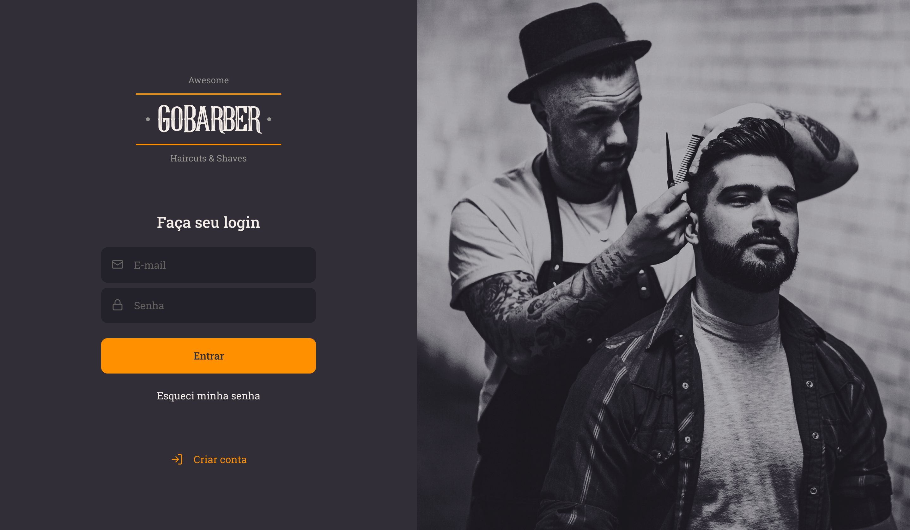
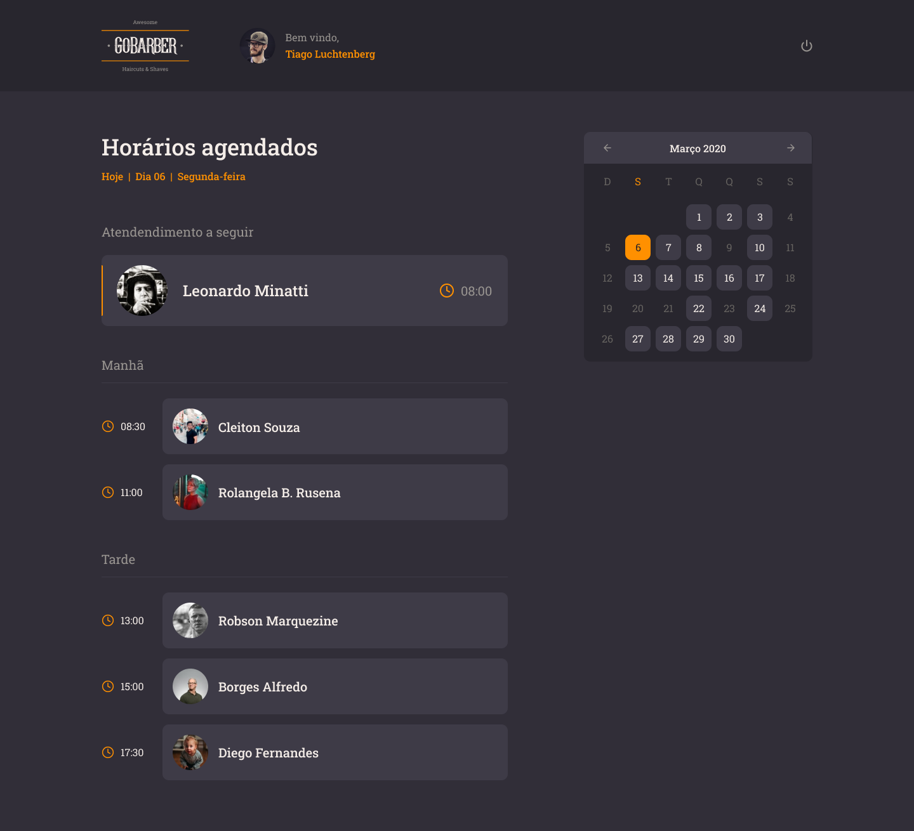

<h1 align="center">
  
</h1>

<h1 align="center">
  GoBarber
</h1>

  Uma aplicação para agendamento de servições de barbearia.

- [Sobre](#sobre)
- [Mobile](#mobile)
- [Web](#web)
- [API](#api)

---

## Sobre

GoBarber é uma aplicação que visa ajudar barbeiros a ter uma agenda mais organizada e previsível e os clientes a encontrarem disponibilidade em serviços de barbearia de uma forma mais prática.

Projeto desenvolvido durante o bootcamp **GoStack** da [Rocketseat](https://rocketseat.com.br/). Um bootcamp não na massa que não está mais disponível, substituído pelo Ignite.

---

## Mobile

[Ver detalhes mobile](./mobile/README.md)

  
  
  

---

## Web

[Ver detalhes web](./web/README.md)

  
  
  

## API

[Ver detalhes API](./api/README.md)

funcionalidades
- cadastros de usuários
- upload de imagem de avatar
- autenticação
- crianção agendamento
- listagem de agendamento